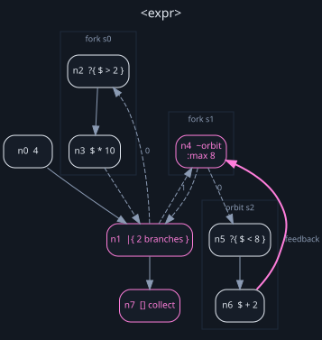

# The Cant graph, version 0

The serialized form of a Cant program: what `cant graph --format json` emits, and
what a renderer — Sigil, eventually — consumes.

**Stability: experimental.** This page is the contract, and a change to the shape
bumps `version` and appears in the changelog — but version `0` means it can still
change. Treat a stored graph as readable only by the tool version that wrote it.

`cant version` reports the schema a binary speaks:

```bash
$ cant version
cant_graph_schema_version: 0
```

Check it and refuse rather than guess. Cant's own reader does:

```text
graph schema version `99`, expected `0`
```

## The contract

**A consumer never has to parse Cant source.** Everything a renderer needs —
structure, order, spans, effects, orbit policy, labels — is in the JSON. Nothing
requires the `.cant` file except showing the user their own text, and the spans
are there to make even that possible.

Here is a program with every construct in it, and its graph:

```cant
4 -> |{ ?{ $ > 2 } -> $ * 10 ; ~{ ?{ $ < 8 } -> $ + 2 } :max 8 } -> []
```



Clusters are subgraphs — a fork branch or an orbit body. Dashed edges enter and
rejoin them; the bold pink edge is an orbit's feedback. Everything in that
picture comes from the JSON below.

## Shape

```json
{
  "version": "0",
  "language_version": "0",
  "entry": 0,
  "exit": 4,
  "nodes": [ … ],
  "edges": [ … ],
  "subgraphs": [ … ],
  "source": { "name": "program.cant", "length": 47 }
}
```

`entry` and `exit` are node identifiers: the first and last node of the top-level
flow. `source.length` is in bytes, so a consumer can tell whether a span it holds
is still in range for the text it has.

### Nodes

```json
{
  "id": 2,
  "kind": "ward",
  "predicate": { "text": "$ > 1", "span": { "start": 17, "end": 22 },
                 "effectful": false, "placeholder": true },
  "span": { "start": 15, "end": 24 },
  "subgraph": 0
}
```

`kind` is one of `source`, `stage`, `scatter`, `collect`, `ward`, `fork`,
`orbit`, and its payload is flattened alongside it:

| `kind` | payload |
|---|---|
| `source`, `stage` | `expr`: a leaf |
| `scatter`, `collect` | — |
| `ward` | `predicate`: a leaf |
| `fork` | `branches`: subgraph ids, **in branch order** |
| `orbit` | `body`: a subgraph id · `identity`: an optional leaf (`:by`) · `max_items`: the `:max` |

A **leaf** is Rite expression text with what Cant knows about it on its own:
`text`, `span`, `effectful` (it carries a `!`), and `placeholder` (it names `$`).
Whether the names in it resolve is Rite's question, not the graph's.

`subgraph` is absent for a node in the top-level flow.

`label` and `layout` are absent unless something put them there — see below.

### Edges

```json
{ "from": { "node": 1, "kind": "out", "index": 2 },
  "to":   { "node": 5, "kind": "in",  "index": 0 },
  "ordinal": 1,
  "role": "enter" }
```

Ports are explicit and numbered:

- **out port 0** is the continuation — the value leaving along the main flow.
- **a fork's out port *n+1*** enters branch *n*; **an orbit's out port 1** enters
  its body.
- **in port 0** is the incoming value; **in port 1** is the join a branch or an
  orbit body returns to.

`role` is one of:

| `role` | meaning |
|---|---|
| `flow` | one stage to the next |
| `enter` | a fork or orbit into its branch or body |
| `join` | a fork branch returning its emissions to the fork |
| `orbit_feedback` | an orbit body returning candidates to the worklist — **the only cycle** |

**Branch order lives in `ordinal`, not in the array order.** A consumer that
sorts or reorders the edge list must still read branch order correctly, and one
that relies on array position will be wrong the first time anything reorders.

The orbit feedback edge is a real edge rather than something implied by the node,
so that "every cycle must belong to an orbit" is a question a validator can
actually ask. Expect exactly one cycle per orbit, and draw it distinctly —
`cant graph --format dot` draws it bold, pink and `constraint=false`.

### Subgraphs

```json
{ "id": 0, "owner": 1, "entry": 2, "exit": 4, "nodes": [2, 3, 4] }
```

A fork branch or an orbit body. `owner` is the node that contains it; `nodes` is
its members in flow order. `entry` and `exit` are absent for an empty branch,
which is a validation error but still has to be representable.

Every node appears once in the flat top-level `nodes` array, whatever subgraph it
belongs to. A renderer walking `nodes` sees all of them; `subgraphs` gives the
grouping. Nothing is nested, so nothing needs recursive traversal to enumerate.

## Layout is reserved, and never semantic

```json
{ "id": 3, "kind": "scatter", "span": { … },
  "label": "fan out the paths",
  "layout": { "x": 220.0, "y": 96.0, "width": 80.0 } }
```

`label` and `layout` exist for an editor to write into. **Nothing in compilation,
validation or execution reads either.** A graph with every one of them stripped
behaves identically — geometry stays out of the language. Both survive a JSON
round trip, so a renderer's work is not lost by a tool that reads and rewrites
the graph.

## Identifiers are stable, not unique

Identifiers are assigned by a depth-first walk in source order, so the same source
and tool version always produce the same numbers — a diff of two graphs reads as
a diff of the program.

They are **not** globally unique. Two graphs from different sources both start at
`0`, so a consumer storing several must key them by graph.

## Deserialized graphs are untrusted

Cant validates a graph read from JSON on the same terms as one it built. The
checks that matter to a consumer:

- dangling edges, and ports a node does not have;
- duplicate identifiers;
- a branch that does not rejoin the fork that opened it;
- **any cycle that is not orbit feedback** — relabelling one as
  `orbit_feedback` does not launder it.

Do not assume a graph you did not produce is valid. Run it through
`cant_sem::validate_deserialized`, or reimplement those checks.

## Reading it from Rust

```rust
use cant_sem::{validate_deserialized, CantProgram};

let analysis = validate_deserialized(&json, file_id)?;
if analysis.diagnostics.has_errors() {
    // report and stop; the graph is not safe to walk
}
for node in &analysis.graph.nodes {
    // `node.kind` is the tagged enum above
}
```

`CantProgram` also answers the three questions a renderer or an explainer asks
without walking anything: `capabilities()`, `effectful_nodes()`, and
`max_orbit_items()`.

## What could change

Things version 0 does not settle, so a consumer knows where the edges are:

- **Named anchors and explicit feedback edges** would add edge roles and would end
  "exactly one cycle per orbit".
- **Parallel fork** would need an ordering or concurrency field on the fork node.
  Today sequential-left-to-right is implied by the branch ordinals alone.
- **Error-routing edges** would add a role and a second out-port convention.
- **Multi-output nodes** are representable — that is why ports are numbered
  rather than anonymous — but nothing produces one yet.
