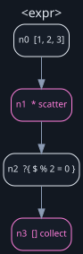
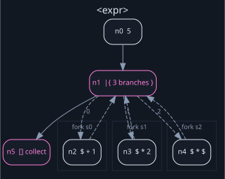
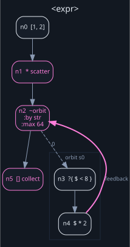
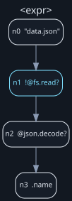

# The Cant language

A Cant program is one flow: a chain of stages, each receiving one value and
emitting zero or more.

```cant run
[1, 2, 3, 4, 5, 6] -> * -> ?{ $ % 2 = 0 } -> []
```

That is the shape of the language. Everything below is what a stage can be.

## Emissions

Every stage takes one input value and produces a list of output values, and the
next stage runs once per value:

| Stage | Emits |
|---|---|
| a source expression | one value |
| an ordinary stage | its one returned value |
| a ward | the unchanged input, or nothing |
| `*` | one emission per element of a list |
| `[]` | one list holding every emission that reached it |
| a fork | its branches' emissions, concatenated in order |
| an orbit | every first-seen candidate, in breadth-first order |

At the end of the program, collection is implicit: zero emissions become `none`,
one becomes that value, and many become a list in emission order.

A list is an ordinary Rite value and does not turn itself into multiple
emissions. `*` is always written, so `xs -> count` counts the list rather than
its elements.

## Stages

### Ordinary stages

A stage is Rite expression text. The current emission goes into the first
argument position, unless the stage contains an explicit `$`:

```cant run
"cant" -> upper
```

evaluates `upper("cant")`. With an explicit `$`, the emission goes exactly where
you put it:

```cant run
"-" -> join(["a", "b"], $)
```

is `join(["a", "b"], "-")`. A projection reads as one:

```cant run
<< message: "hi" >> -> .message
```

First-argument insertion is Rite's own pipeline rule; Cant does not invent a
second one. A capability call is the one place the two differ: Rite's pipeline
does not insert into `@fs.read`, so Cant writes the argument out rather than
leaving it implicit, and `path -> !@fs.read` becomes `!@fs.read(path)`.

Cant does not re-specify Rite's expression grammar. Whatever Rite accepts inside
a stage, Cant accepts — including closures, whose braces are ordinary text to
the Cant parser:

```cant run
[ [1, -1], [-2, -3] ] -> * -> ?{ any($, { |n| n > 0 }) } -> []
```

### Flow — `->` (`→`)

Chains stages. Each stage runs once per incoming emission, in order.

### Scatter — `*` (`⋇`)

Expands a list into one emission per element, preserving order.

Every picture below is `cant graph --format dot` run through Graphviz — the same
topology the program executes, not a drawing of it.



```cant run
[ [1, 2], [3, 4], [5] ] -> * -> sum -> []    // [3, 7, 5]
```

Note the spaces. A stage is Rite expression text, and Rite lexes `[[` as its
block opener, so `[[1, 2], [3]]` is not a valid list in Rite either.

Applied to something that is not a list it is a runtime error, reported at the
`*` rather than somewhere inside generated code.

`*` is scatter only when it is a whole stage; `$ * 2` is multiplication. The
glyph `⋇` is unambiguous, and is an error anywhere a stage is not expected.

### Collect — `[]` (`⌁`)

Consumes every emission reaching it and produces one list, in emission order.

```cant run
[<< active: true >>, << active: false >>] -> * -> ?{ $.active } -> []
```

The end of a program collects implicitly, so writing `[]` matters when the list
has to go somewhere: `… -> [] -> sum` sums the collection, `… -> sum` sums each
emission separately.

As the **first** stage of a program, `[]` is the empty list literal — nothing has
been emitted yet, so there is nothing to gather.

### Ward — `?{ p }` (`⊣⟦ p ⟧`)

A filter. The predicate is evaluated with `$` bound to the incoming emission.

- truthy → the input is emitted **unchanged**;
- falsey → nothing is emitted;
- an error → it propagates, instead of being read as false.

A ward never transforms; use the next stage for that. The predicate is one
expression, not a flow, so `?{ a -> b }` is rejected with a message telling you
to close the ward and continue after it.

Effectful predicates are rejected: Cant has no ordering rules for effects inside
a filter.

### Fork — `|{ a ; b ; c }` (`⫴⟦ a ; b ; c ⟧`)

Ordered branches from the same input value. Each branch receives the identical
immutable input; their emissions are concatenated in source order.

```cant run
5 -> |{ $ + 1 ; $ * 2 ; $ * $ } -> []    // [6, 10, 25]
```



Each branch is a cluster. The dashed edges into them carry the branch number;
the dashed edges back are where the emissions are concatenated.

Fork is sequential, and so is anything effectful inside it. Parallel branches
would need concurrency in the runtime and ordering and cancellation rules in
Cant; neither exists yet, and adding the keyword first would fix the wrong
meaning in place.

Forks nest.

### Orbit — `~{ body }` (`⟲⟦ body ⟧`)

A bounded breadth-first fixed point, and the only cyclic construct in the
language.

<!-- ignore: reads module files this page does not ship; every name in it is
     real, and the same program runs on the site's front page bar the files. -->
```cant ignore
["main"]
  -> *
  -> ~{ !@fs.read($ + ".cant")? -> @regex.find_all($, "use [a-z_]+")? -> * -> replace($, "use ", "") }
     :by str
     :max 4096
  -> []
```

A runnable one, with the same shape:

```cant run
[1, 2] -> * -> ~{ ?{ $ < 8 } -> $ * 2 } :by str :max 64 -> []
```



The bold pink edge is the orbit's feedback: the body's emissions returning to the
worklist. It is the only cycle a Cant program can contain.

1. The worklist starts as a FIFO of the incoming emissions.
2. Pop the next candidate.
3. Compute its identity — `:by f` applies a pure function `f`; otherwise
   structural value identity is used.
4. An identity already seen is skipped. First occurrence wins.
5. Otherwise record the candidate and emit it as part of the orbit's result.
6. Run the body with the candidate as input.
7. Append the body's emissions to the end of the worklist.
8. Stop when the worklist is empty.
9. Fail with a structured diagnostic if `:max` candidates have been accepted, or
   if Rite's global step or time budget runs out.

Rules:

- `:max` must be a positive integer, and defaults to **1024**.
- `:by` must be pure.
- A value with no stable structural identity needs `:by`.
- Effects in the body are allowed, and run once per first-seen candidate.
- The body runs sequentially.

Reaching `:max` is a failure, not a truncated answer. A traversal larger than
expected fails rather than returning a partial result.

Orbit is the only cyclic construct in the language. There are no feedback edges
to named nodes.

### Modifiers — `:name value`

Configure the structural form immediately to their left, with no arrow between:

```cant run
[1, 2] -> * -> ~{ ?{ $ < 8 } -> $ * 2 } :by str :max 1024 -> []
```

The colon must touch the name. That is what keeps `:` usable as Rite's atom
prefix, so `?{ $.level = :error }` reads as the comparison it looks like.

## Modules — `use`

A Cant file is still an expression, not a module — but it can import Rite
modules, which is where named functions come from when builtins and inline
closures are not enough:

<!-- ignore: imports a module this page does not ship; the executed form is
     conformance/cant/execution/use-module. -->
```cant ignore
use mathy
[1, 2, 3] -> * -> mathy.square($) -> []
```

`use name` lines come first, one per line, before the flow. Cant does not
resolve them: the names are emitted verbatim at the top of the generated Rite,
and Rite's module system does everything else — resolution relative to the
program's directory, qualified access, collision reporting. An unknown module
or a typo in a qualified call is Rite's own diagnostic, mapped back onto the
Cant source.

Effect discipline crosses the boundary intact: a call to an effectful module
function takes the marker like any host call (`!logger.shout($)`), and an
unmarked call is rejected by Rite's analysis as it would be in Rite.

## Effects

Cant keeps Rite's effect discipline exactly as it is.

<!-- ignore: reads a file this document does not ship; the runnable version is
     examples/cant/06-capabilities. -->
```cant ignore
"data.json" -> !@fs.read? -> @json.decode? -> .name
```



Effectful stages are drawn in cyan, so what a program touches is visible in its
shape.

`!` marks a host call and `@` names the capability, as in Rite. The Rite this
compiles to contains that same marked call, so Rite's own effect analysis sees
it: an effect inside an orbit is as visible, and as permission-gated, as one at
the top level. Run `cant expand` to see it.

Reads are effects, in Cant as in Rite: `@fs.read`, `@env.get` and `@db.query`
need `!` for the same reason `@clock.now` does.

### Standard input

`@stdin` takes the data on the pipe, with the program on `-e`:

```bash
cat access.log | cant run -e '!@stdin.lines -> * -> ?{ contains($, "500") } -> []'
```

`!@stdin.lines` emits the input as a list of lines and `!@stdin.read` as one
string. An empty pipe is an empty list, so the flow runs zero times instead of
once over `""`. Reading stdin is an effect with its own permission, allowed by
default and revocable with `--deny stdin`.

## Failures

A capability call answers a result, `ok(value)` or `err(record)`. A flow has
three postures toward the `err`, all of them Rite's own vocabulary rather than
new syntax:

**Propagate and stop.** Postfix `?` unwraps the `ok` and ends the run on an
`err`, with the failure mapped back onto the Cant source. The right posture
when a missing file means the program cannot mean anything:

<!-- ignore: reads a file this document does not ship; the runnable form is
     examples/cant/06-capabilities. -->
```cant ignore
"config.json" -> !@fs.read? -> @json.decode? -> .name
```

**Drop the failures.** Without `?`, the `err` flows as an ordinary value —
so a ward can filter on it, and `unwrap_or` opens the survivors:

<!-- ignore: reads files this document does not ship; the executed form is
     conformance/cant/execution/error-dropped. -->
```cant ignore
["a.txt", "b.txt"] -> * -> !@fs.read($) -> ?{ is_ok($) } -> unwrap_or($, "") -> []
```

**Replace with a fallback.** `unwrap_or` alone keeps every emission, failed
reads becoming the default:

<!-- ignore: reads files this document does not ship; the executed form is
     conformance/cant/execution/error-replaced. -->
```cant ignore
["a.txt", "b.txt"] -> * -> !@fs.read($) -> unwrap_or($, "") -> []
```

Both idioms are pinned by `conformance/cant/execution/error-dropped` and
`error-replaced`, interpreted and compiled alike.

## Determinism

No parallelism, no nondeterminism:

- stages execute in source order;
- fork branches execute left to right;
- scatter preserves list order;
- collect preserves emission order;
- orbit uses breadth-first worklist order;
- duplicate detection keeps the first occurrence;
- effects execute sequentially in exactly that order.

## Comments and strings

```cant run
// A line comment. -> ?{ and ⋇ in here are just text.
/* Block comments too. */
"a -> b" -> replace($, "->", "|{")
```

Operator characters inside a string or a comment are never operators.
`cant fmt` and `cant convert` work from the parse rather than the text, so
neither reaches inside one, and neither mistakes the `[]` in `f([])` for a
collect or the `}` closing a Rite closure for the end of a Cant block.

## What Cant does not have

Each of these is deferred, not overlooked:

- **Function definitions.** A `.cant` file is an expression, not a module. Use
  Rite's builtins, a closure inside a stage, or `use` a Rite module and call its
  functions by qualified name.
- **Parallel fork**, **cancellation** and **error-routing edges**. See Fork.
- **Named anchors and arbitrary feedback edges.** Orbit is the only cycle.
- **Lazy or infinite streams.** Every emission set is finite.
- **A second value model, permission system or host runtime.** All three are
  Rite's, unchanged.

---

This page is the reference. [Your first program](tutorial.md) is the
introduction, [one-liners](one-liners.md) a set of recipes, and
[past the one-liner](projects.md) covers files, modules and tests. Diagnostics
are indexed in [when something goes wrong](diagnostics.md).
